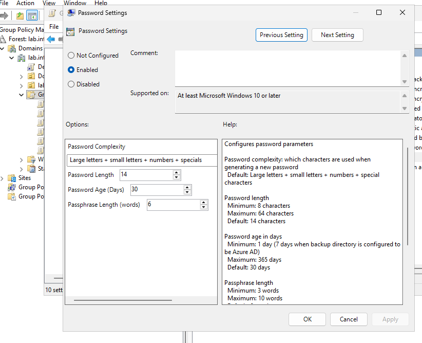
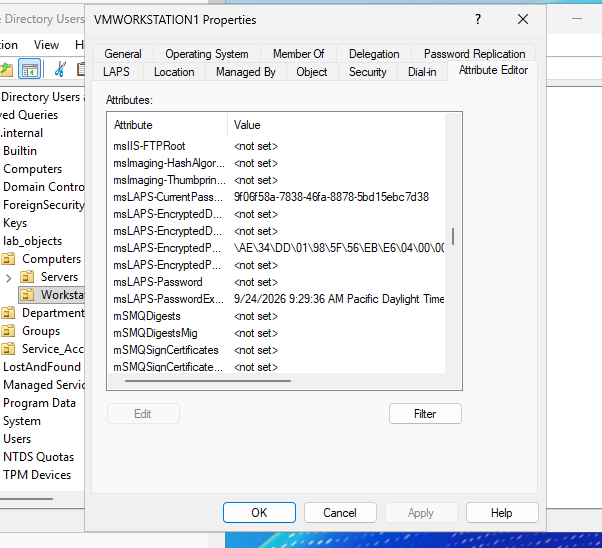

# windows-laps-ad-deployment
Windows LAPS Group Policy deployment, password complexity policy enforcement, and AD schema verification lab.
# Windows LAPS (Local Administrator Password Solution) Management & AD DS Integration

This repository documents the deployment and validation of **Windows LAPS** in Active Directory Group Policy to enforce dynamic, unique, and encrypted local administrator password management across domain endpoints.

---

## Technical Overview

* **Domain Controller:** `DC1.lab.internal`
* **Target Computer Object:** `VMWORKSTATION1` (`lab_objects/Computers/Workstations`)
* **Policy Applied:** Windows LAPS Group Policy Object
* **Schema Extension:** Active Directory Windows LAPS Schema Attributes
* **Password Complexity Standard:** 14 Characters (Upper + Lower + Numbers + Special Characters)
* **Rotation Policy:** 30 Days

---

## Configuration

### 1. Group Policy Password Settings
Configured Windows LAPS policy under **Computer Configuration > Administrative Templates > System > LAPS > Password Settings** to enforce complexity, length, and maximum validity period for target endpoint local administrator accounts.

* **Password Complexity:** Capital letters + Lowercase letters + numbers + specials
* **Password Length:** `14`
* **Password Age (Days):** `30`
* **Passphrase Length (words):** `6`

---

## Active Directory Schema & Attribute Verification

### 2. Active Directory Computer Object Inspection (`dsa.msc`)
Inspected the **Attribute Editor** tab on `VMWORKSTATION1` within Active Directory Users and Computers to confirm active schema extension and local administrator secret storage.

Key validated Active Directory attributes:
* `msLAPS-CurrentPassword`: Active randomized password assigned to the workstation local administrator account.
* `msLAPS-PasswordExpirationTime`: Expiration timestamp governing automated rotation.
* `msLAPS-EncryptedPassword`: Encrypted representation of target credentials.

---

## Implementation Summary

1. Extended Active Directory schema to support modern Windows LAPS attributes (`msLAPS-*`).
2. Authored and linked a dedicated Group Policy Object enforcing password length and rotation time.
3. Applied policy to domain joined endpoint `VMWORKSTATION1`.
4. Verified successful LAPS password generation and expiration within Active Directory Users and Computers.
